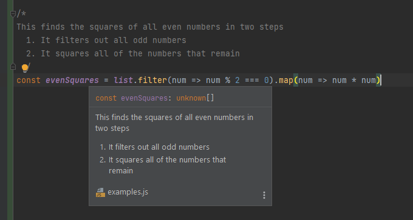
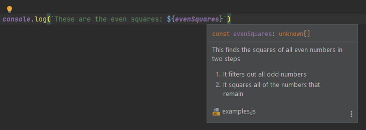

# Introduction to JSDocs

Humans are forgetful creatures. We can only keep so many things in our head. It's why we have tools like calendars,
notebooks, alarms, and so many other tools that help us to remember things.

Though we'd like to think otherwise, programmers are no different. We have so many things to keep track of, it's hard
to keep them straight. We are trying to simulate a whole computer in our brains, after all! It's quite a difficult task
to perform, and it doesn't help that we are having to jump from file to file trying to figure out the next step in the
process.

That's why documentation was created. Documentation gives a high-level definition of the code it is describing and
allows the coder to get an idea of what the code does without having to decipher the code itself. And this is helpful
for the person who writes the code just as much as anyone else.

The most useful form of documentation that we can write as programmers are comments. Comments are inline notes that give
more details about the code it surrounds. And, thanks to tools that have been developed, these comments can be used not
just by the programmer, but by the IDE. It can give argument hints, link to definitions, and even do typechecking.

Well, enough abstract talk. Let's dive right in to the power of JSDocs, the system for documenting JavaScript.

## Describe something

What are comments for? Describing code. Comments can be used to explain what something does.

```js
// Prints "Hello world!" to the console
console.log("Hello world!")
```

Quite simple and straightforward, but now anyone who is reading this code, even if they aren't fluent in JavaScript, can
get a feel for what the line `console.log("Hello world!")` does.

If an extended or inline explanation is needed, `/*` and `*/` can be used instead

```js
// A list of the numbers 1-5
const list = [1, 2, 3, 4, 5]

/*
This finds the squares of all even numbers in two steps
  1. It filters out all odd numbers
  2. It squares all of the numbers that remain
 */
const evenSquares = list.filter(num => num % 2 === 0).map(num => num * num)
```

These comments are pretty helpful, as some of the code may not be super clear. However, they are even more useful when
used in an IDE such as WebStorm. Try opening a new JavaScript file in WebStorm and paste this code in. Then, hover your
mouse over `list` and `evenSquares` in the code. What do you notice?

When your string hovers over the identifier, it brings up a popup that has not just the name of the variable, but also
the text that we wrote in the comments!



This popup can be seen anywhere that the identifier is referenced.



So you don't need to worry about going back to the original comment every time that you forget what the variable is. You
can see the notes you left just by hovering over it! Isn't that convenient?

## Thoughts

Tags:
  * @type
  * @param
  * @returns

Types:
  * primitives (`string`, `number`, `null`, `undefined`, etc.)
  * objects (`{a: string, b: number}`)
  * optionals (`string?`)
  * functions (`function(string): number`)
  * disjoint unions (`string | boolean`)
  * arrays (`string[]`)
  * maps (`{[key: string]: number}`)

Examples
  * Describe a function
  * Add type prompts
  * Type checking
  * More complicated types

Note: WebStorm can automatically generate docs for already written functions