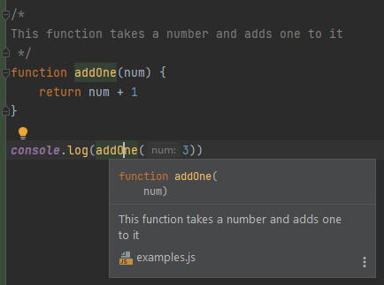
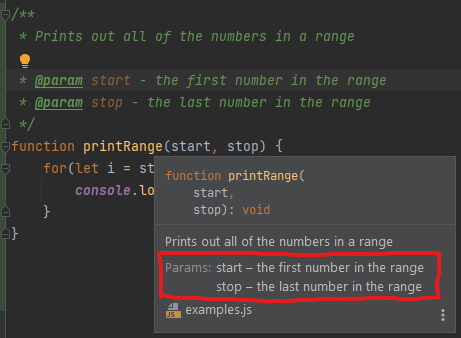
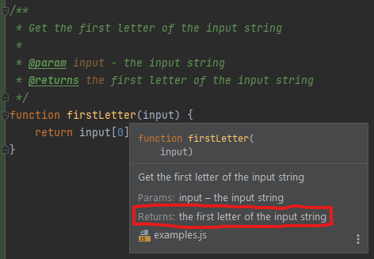
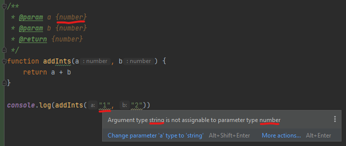
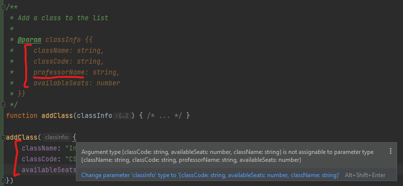
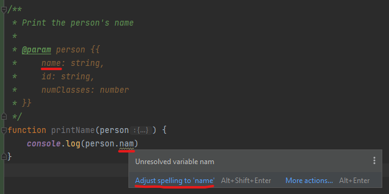
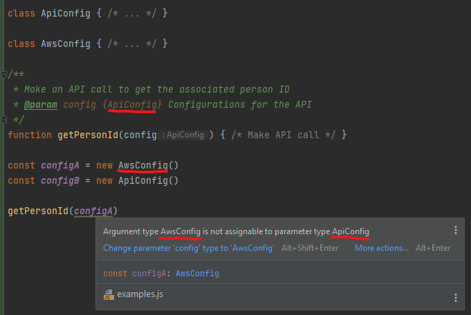
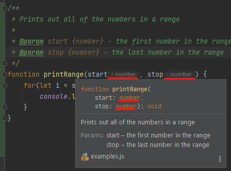
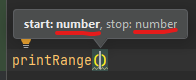

# Introduction to JSDocs

Humans are forgetful creatures. We can only keep so many things in our head. It's why we have tools like calendars,
notebooks, alarms, and so many other tools that help us to remember things.

Though we'd like to think otherwise, programmers are no different. We have so many things to keep track of, it's hard
to keep them straight. We are trying to simulate a whole computer in our brains, after all! It's quite a difficult task
to perform, and it doesn't help that we are having to jump from file to file trying to figure out the next step in the
process.

That's why documentation was created. Documentation gives a high-level definition of the code it is describing and
allows the coder to get an idea of what the code does without having to decipher the code itself. And this is helpful
for the person who writes the code just as much as anyone else.

The most useful form of documentation that we can write as programmers are comments. Comments are inline notes that give
more details about the code it surrounds. And, thanks to tools that have been developed, these comments can be used not
just by the programmer, but by the IDE. It can give argument hints, link to definitions, and even do typechecking.

Well, enough abstract talk. Let's dive right in to the power of JSDocs, the system for documenting JavaScript.

## Describe something

What are comments for? Describing code. Comments can be used to explain what something does.

```js
// Prints "Hello world!" to the console
console.log("Hello world!")
```

Quite simple and straightforward, but now anyone who is reading this code, even if they aren't fluent in JavaScript, can
get a feel for what the line `console.log("Hello world!")` does.

If an extended or inline explanation is needed, `/*` and `*/` can be used instead

```js
// A list of the numbers 1-5
const list = [1, 2, 3, 4, 5]

/*
This finds the squares of all even numbers in two steps
  1. It filters out all odd numbers
  2. It squares all of the numbers that remain
 */
const evenSquares = list.filter(num => num % 2 === 0).map(num => num * num)
```

These comments are pretty helpful, as some of the code may not be super clear. However, they are even more useful when
used in an IDE such as WebStorm. Try opening a new JavaScript file, `comments.js` in WebStorm and paste this code in.
Then, hover your mouse over `list` and `evenSquares` in the code. What do you notice?

(Note: from here on, it is assumed that you are using WebStorm)

When your string hovers over the identifier, it brings up a popup that has not just the name of the variable, but also
the text that we wrote in the comments!


This popup can be seen anywhere that the identifier is referenced.


So you don't need to worry about going back to the original comment every time that you forget what the variable is. You
can see the notes you left just by hovering over it! Isn't that convenient?

## JSDoc Tags

The same idea works for defining functions as well.
```js
/*
This function takes a number and adds one to it
 */
function addOne(num) {
    return num + 1
}

console.log(addOne(3))
```

Type this code into `comments.js`. Notice that if you hover over `addOne`, it shows the attached documentation.



This is great! Now, even if you are in another file, you can see your notes on the functions you wrote, which will help
you to remember how they are supposed to be used.

However, JSDocs has provided annotations that can help you even more! In order to use JSDoc annotations, the comment
needs to start with `/**` (note the extra asterisk).

```js
/**
 * ...(documentation)...
 */
```

There are two annotations for functions that we'll focus on here: `@param` and `@returns`.

### `@param`

The `@param` annotation allows you to describe the parameters of a function. It should be used once for each parameter.
For example,

```js
/**
 * Prints out all of the numbers in a range
 * 
 * @param start - the first number in the range
 * @param stop - the last number in the range
 */
function printRange(start, stop) {
    for(let i = start; i <= stop; i++) {
        console.log(i)
    }
}
```

Notice the format: `@param [parameter name] - [parameter description]`. Now type this code into `comments.js`, then
hover over `printRange`. What do you notice that is different from previous popups?

If you look closely, you'll see that the popup has a new section labeled with `Params:` which lists all of the
descriptions that you gave for the parameters.



This serves as a great reminder for what each parameter is for.

### `@returns`

The `@returns` describes the return value of the function. It should only be used once per function, since functions can
only return a single value.

```js
/**
 * Get the first letter of the input string
 * 
 * @param input - the input string
 * @returns the first letter of the input string
 */
function firstLetter(input) {
    return input[0]
}
```

For `@returns`, the format is `@returns [return value description]`. Try it out in your code!

A new section has appeared: `Returns`!



## IDE Tools

Well, we have specialized sticky notes for our variables. Yay. Now we're getting somewhere... :roll_eyes:

But wait, that's not all. The IDE can do so much more for us! All we have to do is give it a little more information...

### Type annotations

Want to make your JSDocs *really* useful? Add some type annotations!

The format for `@param` is `@param [parameter name] {[parameter type]} - [parameter description]`—just insert the
parameter type in braces after the parameter name. And the format for `@returns` is very similar:
`@returns {[return value type]} [return value description]`.

```js
/**
 * Parses two integers and adds them together.
 * 
 * @param valA {string} - the first integer value as a string
 * @param valB {string} - the second integer value as a string
 * @returns {number} the two values added together
 */
function parseAndAdd(valA, valB) {
    const valAInt = parseInt(valA)
    const valBInt = parseInt(valB)
    return valAInt + valBInt
}
```

It is also possible to add type annotations to variables with the `@type` annotation which takes the format of
`@type {[variable type]}`.

```js
/**
 * The name of the default browser
 * 
 * @type {string}
 */
var defaultBrowser = "Internet Explorer"

/**
 * Result to append to
 * 
 * @type {string}
 */
let result = "Results: "

/**
 * My name
 *
 * @type {string}
 */
const myName = "John Doe"
```

This type information allows the IDE to help you in a couple different ways that we will discuss, but first, let's talk
about what types are valid.

#### Types

The syntax that you can use to express types is very powerful, since it corresponds to the TypeScript type system.
However, in this intro, we will only be covering a small subset of the type system. If you want to read more, go to
TypeScript's [Everyday Types](https://www.typescriptlang.org/docs/handbook/2/everyday-types.html) documentation.

One kind of types is *primitives*, which include the following:
* `string`: represents string values like "John Doe"
* `number`: represents numerical values, both integers (`10`) and floats (`3.14`)
* `boolean`: represents `true` and `false`

Another type is *arrays*, which are a list of values of the same type. The type is represented by the type of the inner
values followed by `[]`. For example, the type of `["a", "bc", "def"]` is `string[]`, while the type of `[1, 2, 3]` is
`number[]`.

Objects can also be represented. Objects are enclosed with braces, with a list of properties and property types.

```
{
    name: string,
    id: number,
    exams: string[],
    roommate: {
        name: string,
        id: number
    }
}
```

Notice that a property type can be a nested object.

Classes can also be used as types. Simply use the class name where the type goes.

Finally, if you need to specify that a variable can have any type, you can use `any` (though you lose the benefit of
specifying the type.)

Here are a couple examples.

```js
/**
 * @type {string}
 */
const hello = "Hello!"

/**
 * @type {number}
 */
const numPotatoes = 1

/**
 * @type {boolean}
 */
const isFresh = true

/**
 * @type {number[]}
 */
const powersOfTwo = [1, 2, 4, 8, 16, 32]

// Note the double sets of braces (one to indicate that it is a type,
// one to indicate that it is an object)
/**
 * @type {{
 *     profile: string,
 *     optimizationLevel: number
 * }}
 */
const config = {profile: "dev", optimizationLevel: 3}

class MyClass { /* ... */ }

/**
 * @type {MyClass}
 */
const myObj = new MyClass()

/**
 * @type {any[]}
 */
const myList = ["foo", 2, false]

/**
 * Get the length of the string
 *
 * @param s {string}
 * @return {number} the length of the string
 */
function stringLength(s) {
    return s.length
}

/**
 * Converts a string containing space-separated integers to a list of numbers
 *
 * @param s {string} a string containing integers separated by a space
 * @return {number[]} the list of numbers in the string
 */
function stringToList(s) {
    const nums = s.split(" ")
    return nums.map(parseInt)
}
```

### Type Checking

Now that we've established the way to insert type annotations in your code, we can explore the different tools that the
WebStorm IDE provides based on these type annotations. One really useful tool is soft type checking!

Vanilla JavaScript is dynamically-typed, which means that type checking happens while the program is running. In other
words, JavaScript doesn't check whether an object has a function until it needs it. This can be convenient for things
like rapid prototyping, since you don't have to worry about types for rapidly changing code, but for writing large code
bases that are maintainable, it can be helpful to have a type checker double-checking your reasoning.

Well, you can get the best of both worlds. Code with normal dynamic typing, then, when you're ready for type checking,
simply add on type annotations and let the type checking begin!

As an example, type the following code into `comments.js` and run it.

```js
function addInts(a, b) {
    return a + b
}

console.log(addInts("1", "2"))
```

It runs, doesn't it? But it prints out `12`, not `3`, like we were expecting. Now go ahead and add type annotations to
the `addInts` function so that `a` and `b` are `numbers` and `addInts` returns a `number`.

```js
/**
 * @param a {number}
 * @param b {number}
 * @return {number}
 */
function addInts(a, b) {
    return a + b
}

console.log(addInts("1", "2"))
```

Notice anything? `"1"` and `"2"` now have squiggly underlines. If we hover over them, the IDE now warns us that we
aren't allowed to give `addInts` a string for `a` or `b`!



Well, I guess we should probably give it numbers instead...

This example is somewhat contrived, but this kind of type checking can be super helpful can be very helpful when the
objects being passed around get more complex. A few examples follow.



*Forgot to add the `professorName` property to the object we were passing in!*

<br>



*Misspelled a property! While trying to access `person.name`, we left off an `e`.*

<br>



*Wrong config variable! `configA` is an `AwsConfig`, but we want `configB`, the `ApiConfig`.*

<br>

### Autocomplete

## Thoughts

-----
### `@param`
And we can make this even more useful by adding types to our annotations. We expect both start and stop to be numbers,
so we can add the type `number` in braces right after the parameter name.

```js
/**
 * ...
 * @param start {number} - the first number in the range
 * @param stop {number} - the last number in the range
 */
```

Try it in your own code! Observe how the popup has changed again.

Notice how in the popup, in the function definition, it now lists the type for each parameter. It also lists the type
within the code itself.



Also note that whenever you use the function, it now gives you the type of the parameter directly in the prompt.



*Note: a more detailed treatment of what types are valid will be found later in this intro*

-----

Tags:
  * @type
  * @param
  * @returns

Types:
  * primitives (`string`, `number`, `null`, `undefined`, etc.)
  * objects (`{a: string, b: number}`)
  * optionals (`string?`)
  * functions (`function(string): number`)
  * disjoint unions (`string | boolean`)
  * arrays (`string[]`)
  * maps (`{[key: string]: number}`)
  * classes (`MyClass`)
  * `@typedef`
  * "string" type (`"a" | "b"`)

Examples
  * Describe a function
  * Add type prompts
  * Type checking
  * More complicated types
  * first letter -> option

Note: WebStorm can automatically generate docs for already written functions